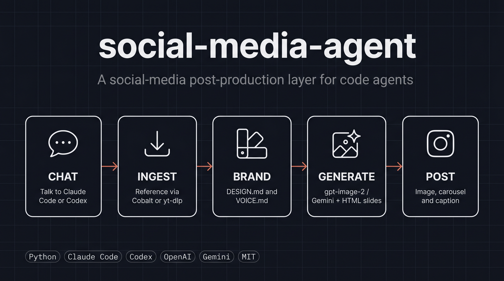

<p align="center">
  
</p>

<p align="center">
  <a href="LICENSE"></a>
  
  
  
</p>

# social-media-agent

A social-media post-production layer for code agents — drive it from Claude Code or Codex.

It is a tested Python toolkit plus a file-based meta-project for producing Instagram posts
per profile. There is no server, database, or frontend: the state lives on disk under
`profiles/<name>/`, and the agent (Claude Code or Codex) is the driver that calls the
toolkit's functions.

## What it does

Per-profile Instagram post production:

- **Ingest references** from Instagram, X/Twitter, and YouTube links (Cobalt for image
  carousels, yt-dlp for video).
- **Brand-aware prompts** built from each profile's `DESIGN.md` (palette, fonts, principles,
  anti-references) and `VOICE.md`.
- **Multi-engine image generation** — OpenAI `gpt-image-2` and Google Gemini.
- **HTML text-slide rendering** with real fonts for templated, copy-heavy slides.
- **Multi-slide carousels** — N slides become N output images, never collapsed into one.
- **Grounding** — anchor real people, places, or objects to real reference images before
  generating, so the model does not invent subjects.
- **Audit / learning loop** — scan past posts, detect brand drift, extract patterns, and
  feed learnings back into future prompts.

## Designed to be used with Claude Code or Codex

The agent is the driver; this package is the tested toolkit it calls. You talk to the agent
conversationally (paste a link, ask for a caption, request an edit) and it invokes the
`social_media_agent` package under the hood. You can also call the package directly from
Python if you want.

## Requirements

- **Python ≥ 3.11**
- **Node.js + pnpm** — for the local Cobalt instance (Instagram image/carousel ingest)
- **ffmpeg**
- An **OpenAI** and/or **Gemini** API key

## Quickstart

```bash
git clone <repo-url> social-media-agent
cd social-media-agent
./install.sh
```

`install.sh` creates a virtualenv, installs the package (`pip install -e .`), copies
`.env.example` to `.env`, symlinks the skill for both Claude Code and Codex, and provisions
the local Cobalt instance.

Then set your keys in `.env`:

```bash
OPENAI_API_KEY=sk-proj-...   # for gpt-image-2
GEMINI_API_KEY=AIza...       # for Gemini (optional)
```

Use it:

- **Claude Code** — `/social-media-agent` (or just paste a link and describe the post).
- **Codex** — open the repo; `AGENTS.md` gives project context and the `.codex` skill drives
  the workflows.

## Example profile

`profiles/example-brand/` ships as a reference profile (a fictional minimalist studio). It
shows the canonical schema:

```
profiles/example-brand/
├── brand-kit/
│   ├── DESIGN.md      # palette, fonts, mark, principles, anti-refs (YAML + markdown)
│   └── pages/         # brand-kit PNGs, attached as image refs in every prompt
├── VOICE.md           # tone, go_words, no_go_words, contexts
├── assets/            # optional
└── references/        # optional
```

Copy it and adapt it for your own brand, or create new profiles under `profiles/<name>/`.

## Documentation

- [docs/getting-started.md](docs/getting-started.md) — install and first use
- [docs/usage.md](docs/usage.md) — every command and workflow with examples
- [docs/architecture.md](docs/architecture.md) — how it is built, subsystems, key decisions

## Repo layout

```
social-media-agent/
├── src/social_media_agent/             tool-agnostic Python package (the implementation)
├── AGENTS.md                           Codex project context
├── .codex/skills/social-media-agent/   Codex skill driver (synced with Claude)
├── .claude/skills/social-media-agent/  canonical detailed driver + 5D reference
├── profiles/<name>/                    profiles (one per Instagram account)
├── docs/                               getting-started, usage, architecture
├── tests/                              pytest suite
├── install.sh                          venv + pip install -e . + skill symlinks
├── pyproject.toml                      package + deps (src layout)
└── .env.example                        API key template
```

## License

MIT. See [LICENSE](LICENSE).
